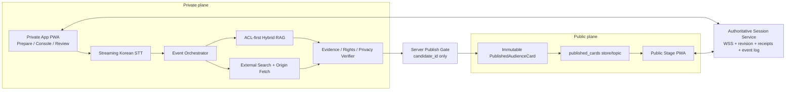
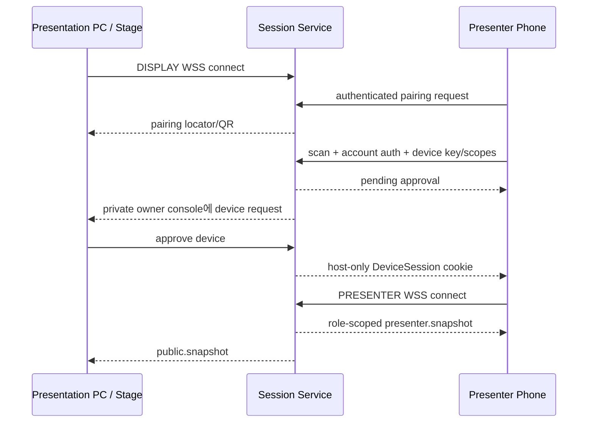

# AI 발표 에이전트 PWA 구현 최적화 연구보고서

> 연구 대상: `docs/신청서.pdf` 17쪽 전체 텍스트·표·구조도·이미지  
> 작성일: 2026-08-14  
> 결론: **PWA를 유지하되 공개 Stage와 Presenter Console을 보안상 분리하고, 확장 화면과 화면 복제를 서로 다른 실행 모드로 구현한다.**

## 1. 결론 요약

이 시스템의 최적 구현은 “한 브라우저 창에서 모든 기능을 숨겨 나누는 방식”이 아니다. 다음 세 개의 역할을 서버 권한과 데이터 계약으로 분리해야 한다.

1. **Private App**: 준비, 마이크, STT, 검색/RAG, 검증, Presenter Console
2. **Public Stage**: 슬라이드와 승인된 근거 카드만 표시
3. **Session Service**: 권위 상태, WebSocket relay, 공개 게이트, 이벤트 로그

권고 배포는 Private App과 Public Stage를 서로 다른 origin, 가능하면 서로 다른 registrable domain으로 분리하는 것이다. Public Stage는 transcript, 후보 카드, 내부 문서, 팀 메시지, 코칭 정보에 접근할 credential이나 네트워크 경로 자체가 없어야 한다.

Windows **확장 화면**에서는 Chromium desktop의 Window Management API를 progressive enhancement로 사용한다. API가 지원되고 권한을 받으면 Stage 창을 외부 화면 좌표에 배치한다. 다만 이 API는 Baseline이 아니며 Firefox·Safari에서는 지원되지 않으므로, “창 열기 -> Win+Shift+Left/Right 또는 직접 이동 -> Stage에서 전체화면 클릭”을 정식 폴백으로 제공해야 한다.

Windows **화면 복제**에서는 발표 머신에 Presenter Console을 띄우면 비공개 정보가 그대로 복제된다. 따라서 발표 머신에는 Public Stage만 띄우고, 휴대폰·태블릿·다른 노트북에 Presenter Console을 띄운다. 두 기기는 클라우드 WSS relay로 동기화하며 QR은 권한 토큰이 아니라 짧게 살아 있는 pairing transaction locator만 포함한다.

## 2. 신청서에서 도출한 제품 계약

신청서는 이미 중요한 방향을 올바르게 정했다.

- PPTX/PDF 업로드 시 `deck_id`, `slide_id`, `version`을 생성한다.
- 슬라이드의 텍스트·표·차트·발표자 노트를 구조적으로 추출한다.
- OCR/VLM은 구조 파싱이 어려운 슬라이드에만 업로드 단계에서 사용한다.
- 웹 뷰어가 현재 슬라이드 이벤트를 직접 발생시키며 화면 캡처로 추측하지 않는다.
- 부분 STT는 자막과 검색 예열에만 사용한다.
- 확정 STT와 현재 슬라이드가 결합된 이후에만 검색·검증을 시작한다.
- 내부 RAG는 ACL 선필터, revision, anchor, content hash를 가진다.
- 검증 결과는 `SUPPORTED`, `UNCERTAIN`, `CONFLICTING`, `UNSUPPORTED`로 나눈다.
- 카드의 신선도는 `CURRENT`, `STALE`, `SUPERSEDED`로 별도 관리한다.
- 발표 후 리포트는 UI 값을 모으는 것이 아니라 이벤트를 재계산해 만든다.

한 가지 중요한 모순도 있다. 신청서 p7~9는 `SUPPORTED`를 공개 가능한 상태로 설명하지만 p10은 발표자 또는 팀원의 승인을 받은 자료만 표시한다고 한다. 구현에서는 이를 다음 세 축으로 분리해야 한다.

```text
verdict     = PENDING | SUPPORTED | UNCERTAIN | CONFLICTING | UNSUPPORTED
publication = HIDDEN | AWAITING_APPROVAL | PUBLISHED | REJECTED
freshness   = CURRENT | STALE | SUPERSEDED
```

`SUPPORTED`는 **공개됨**이 아니라 **공개 자격이 있음**을 뜻한다. `SUPPORTED + CURRENT + 권리 확인 + 개인정보/DLP 통과`인 후보만 승인 대기 상태가 되고, active controller 한 명이 승인하면 서버가 공개 DTO를 새로 만든다.

## 3. 권고 시스템 아키텍처



### 3.1 보안 경계

권고 예시:

- `https://presenter-app.example`: 마이크, Console, private API, private WSS
- `https://audience-display.example`: 공개 Stage, public API, public WSS

서로 다른 registrable domain이 어렵다면 sibling subdomain을 사용할 수 있지만, 이 경우 두 origin은 같은 site이므로 `SameSite=Strict`만으로 sibling-origin CSRF를 막을 수 없다. 모든 상태 변경은 synchronizer CSRF token과 exact `Origin` 검사를 사용하고, WSS upgrade도 exact origin allowlist를 적용한다.

Public Stage의 모든 관찰 가능한 byte는 `PublishedAudienceCard`와 공개 발표 상태만의 함수여야 한다. private 이벤트를 보내고 CSS로 숨기거나 client-side filter로 제거하는 방식은 금지한다.

### 3.2 공개 DTO

서버만 다음과 같은 닫힌 스키마를 생성한다.

```ts
type PublishedAudienceCard = {
  id: string;
  title: string;
  body: string;
  sourceLabel: string;
  canonicalUrl: string;
  publishedAt?: string;
  basisDate?: string;
  approvedAssetHash?: string;
  attribution?: string;
  altText?: string;
  expiresAt: string;
};
```

`additionalProperties: false`로 검증하며 HTML/Markdown, 내부 URI, 문서 ID, raw excerpt, transcript, prompt, query, ACL, 팀원, provider/debug 필드는 거부한다. Console은 공개 JSON을 만들지 않고 `candidate_id`만 승인 요청에 보낸다.

## 4. 확장 디스플레이 모드

### 4.1 지원 계층

| 계층 | 환경 | 동작 |
|---|---|---|
| Tier 0 | 모든 현대적 HTTPS 브라우저 | Stage 창 열기, 수동 이동, Stage 내부 전체화면 클릭 |
| Tier 1 | Chromium desktop | `getScreenDetails()`로 화면 선택·자동 배치, topology change 대응 |
| Tier 2 | 설치형 PWA | standalone 창·OS 실행 통합·offline shell; 추가 권한은 없음 |

Window Management API는 Chrome 100+/Edge 계열에서 사용할 수 있으나 Firefox·Safari는 미지원이다. 기능 탐지로만 분기하고 UA 문자열을 사용하지 않는다.

### 4.2 가장 매끄러운 1-click 흐름

W3C 예시가 허용하는 가장 매끄러운 형태는 launcher 문서 자체를 외부 화면에서 fullscreen으로 만들고 같은 사용자 제스처 안에서 Presenter Console popup 하나를 내부 화면에 여는 것이다.

```text
Launcher에서 "발표 시작"
  -> window-management 권한/화면 선택
  -> launcher를 외부 화면 Stage로 fullscreen
  -> 내부 화면에 Console popup 1개 open
  -> WSS로 두 화면 role 등록
```

그러나 보안상 Stage를 별도 origin으로 분리하면 현재 Console이 cross-origin child Stage DOM에 `requestFullscreen()`을 호출할 수 없다. 이때는 더 안정적인 두 단계 흐름을 사용한다.

```text
Console: "관객 화면 열기" 클릭
  -> target screen의 availLeft/Top/Width/Height로 Stage popup 배치
Stage: "전체 화면 시작" 1회 클릭
  -> Stage 문서 자체의 transient activation으로 requestFullscreen()
Console: WSS heartbeat/ready receipt로 연결 확인
```

### 4.3 폴백과 복구

- `window.open()`이 `null`이면 팝업 허용 안내를 제공한다.
- API 권한 거부 또는 미지원이면 창을 열고 수동 이동 안내를 제공한다.
- Windows 안내: `Win+P -> 확장`, `Win+Shift+Left/Right`로 창 이동, `Win+K`로 무선 화면 연결.
- 화면 추가·제거·위치 변경 이벤트가 발생하면 “DISPLAY NEEDS CONFIRMATION”으로 전환한다.
- topology가 불확실하면 Console에 privacy curtain을 적용하고 재확인 전 private pane을 숨긴다.
- 설치형 PWA도 popup, fullscreen, microphone, window-management의 사용자 제스처와 권한 규칙을 우회하지 못한다.

## 5. 화면 복제 모드와 원격 Presenter Console

### 5.1 핵심 원칙

화면 복제 상태에서 발표 머신은 **AudienceDisplaySession만 가진다**. 해당 브라우저 프로필에는 Console cookie가 없어야 한다. Presenter Console은 개인 기기에서 실행한다.



실제 MVP에서는 QR이 private setup console에 표시된다는 전제하에 다음 흐름을 권고한다.

1. 서버가 128-bit 이상 CSPRNG `pair_id`를 생성한다.
2. `pair_id`는 single-use, 90초 TTL이며 권한을 부여하지 않는다.
3. 새 기기는 동일 계정으로 로그인하고 device key와 requested scopes를 보낸다.
4. 기존 Console이 기기명·계정·scope를 보고 승인한다.
5. 승인 시 `pair_id`를 원자적으로 소비하고 새 presentation-scoped DeviceSession을 host-only HttpOnly cookie로 발급한다.
6. 익명 pairing은 MVP에서 제외한다.

QR fragment의 고엔트로피 secret을 one-use redemption credential로 사용할 수도 있지만, 사진·extension·JS에 노출되면 bearer라는 사실은 변하지 않는다. 비권한 `pair_id + 계정 인증 + 기존 Console 승인`이 더 단순하고 강한 기본값이다.

### 5.2 실시간 전송 선택

| 방식 | 결론 | 이유 |
|---|---|---|
| WebSocket/WSS | MVP 채택 | 성숙한 지원, outbound TCP 443, 중앙 인증·순서·snapshot 용이 |
| WebRTC DataChannel | 선택적 후속 | signaling·ICE·TURN 필요, direct path 보장 없음 |
| WebTransport | 보류 | peer transport 아님, UDP 차단, API/spec 성숙도 부담 |
| BroadcastChannel | 원격에 사용 불가 | 같은 origin/storage partition/device 내부 통신만 가능 |

Cloud WSS relay를 권위 경로로 유지한다. LAN/WebRTC fast path는 실제 telemetry에서 WSS SLO를 놓칠 때만 추가한다. 완전 offline LAN은 trusted local TLS relay와 인증서 provisioning이 필요한 별도 제품 모드다.

### 5.3 프로토콜 불변식

- 각 command는 `commandId`, `controllerEpoch`, `baseRevision`을 가진다.
- 서버는 현재 controller lease와 epoch를 검증한다.
- 중복 `commandId`는 원래 결과를 반환하고 재적용하지 않는다.
- client는 `localRevision + 1`만 적용하며 gap이면 role-scoped snapshot을 요청한다.
- 재연결 시 `lastSeenRevision`, `lastAckedCommandId`, `controllerEpoch`를 보낸다.
- offline 중 `slide.next`, `toggle` 같은 상대 명령은 자동 replay하지 않는다.
- `slide.set`, `blackout.set` 같은 절대 intent도 snapshot 이후 같은 idempotency key로만 재시도한다.

권고 SLO는 보장이 아니라 측정 목표다.

- Console command -> Stage applied: p50 <=150ms, p95 <=300ms, p99 <=750ms
- 연결 가능한 네트워크에서 reconnect -> authoritative snapshot: p95 <=2s
- approval accepted -> audience applied: p95 300~500ms 이내

### 5.4 Controller takeover

- active controller는 한 명이다.
- 두 번째 Console은 takeover를 요청한다.
- 현재 Console은 10초 안에 승인/거절한다.
- 현재 Console이 응답하지 않으면 deck owner가 재인증 후 강제 takeover할 수 있다.
- takeover는 `controllerEpoch`를 증가시키고 이전 socket/session을 폐기한다.
- 이전 epoch의 모든 queued command는 `STALE_CONTROLLER`로 거부한다.

## 6. 실시간 AI·RAG 파이프라인

### 6.1 업로드 경로

Supabase Edge Functions는 Deno/TypeScript 전용이므로 python-pptx·LibreOffice 전처리에 적합하지 않다.

- MVP: 관리자용 로컬 Python 업로더
- 다중 사용자 업로드: Cloud Run Python worker
- PPTX: python-pptx로 구조·notes·slide ID 추출
- 렌더링: LibreOffice headless로 PDF/PNG 생성
- PDF: PyMuPDF로 좌표 포함 텍스트 추출
- OCR/VLM: 파싱 실패·복합 시각 슬라이드에만 적용
- 결과: slide registry, chunks, anchors, images, cached visual summary

### 6.2 Live 경로와 5초 budget

5초는 **사람의 승인과 공개까지**가 아니라 **확정 발화가 끝난 뒤 Console에 최대 3개 eligible recommendation이 표시될 때까지**의 SLA다.

| 단계 | p50 목표 | p95 할당 |
|---|---:|---:|
| STT endpoint/final | 0.35s | 0.70s |
| slide fusion·trigger·query | 0.15s | 0.35s |
| 내부/외부 병렬 검색 | 0.35s | 0.80s |
| 원문 fetch·parse | 0.50s | 1.20s |
| deterministic checks·verifier | 0.45s | 1.10s |
| rank·persist·push·render | 0.10s | 0.25s |
| 합계 | 1.90s | 4.40s |

이 숫자는 vendor 보장이 아니라 구현 budget이다. 실제 한국어 발표, 학교 네트워크, 목표 마이크로 부하 테스트해야 한다. 4.4초에서 hard cutoff하고, 원문 fetch를 2~3개로 제한하며 timeout 시 abstain한다.

### 6.3 STT

Deepgram Nova-3, Azure Speech, Google STT, AWS Transcribe 모두 한국어 streaming/partial-final 의미를 문서화한다. 문서는 한국어 WER·숫자·고유명사·한영 code-switch 정확도를 증명하지 않는다. 실제 발표 녹음 corpus로 bake-off한 뒤 선택한다.

부분 transcript는 다음에만 사용한다.

- 자막 임시 표시
- query candidate·embedding 예열
- 음절 속도와 진행 상태의 임시 추정

공개 검증과 카드 생성은 확정 transcript에서만 시작한다.

### 6.4 내부 RAG 권한

Authorization은 vector search나 LLM에게 위임하지 않는다.

1. 서버가 `tenant, subject, groups, clearance, purpose, presentation, policy_version`을 session에서 도출한다.
2. tenant partition과 ABAC/ReBAC filter를 ANN/top-k 전에 적용한다.
3. 반환 object를 policy engine이 post-authorize한다.
4. 원문 bytes materialization 시 재인가한다.
5. 카드 publication 직전에 ACL·revision·content hash를 다시 확인한다.

ANN 후 post-filter만 가능한 저장소는 요구에 맞지 않는다. 정책 서비스 실패, metadata 누락, stale revision이면 zero result로 fail closed한다.

### 6.5 외부 근거와 출처 검증

검색 snippet을 근거로 사용하지 않는다. 후보 URL의 원문을 가져와 다음을 기록한다.

- canonical URL
- retrieved time와 발행/기준 날짜
- content hash
- heading/page/line/table cell anchor
- 실제 quote
- 기관·수치·단위·날짜·고유명사

LLM structured output은 schema만 보장하며 사실성을 보장하지 않는다. LLM은 claim/query/expected fields 후보만 만들고 URL·ACL·slide ID·숫자를 사실로 만들지 못하게 한다.

## 7. 보안·개인정보·권리

### 7.1 발표 화면 데이터 diode

Audience Gateway는 private DB, bucket, queue, topic, KMS key, vendor job에 접근할 credential이나 network path가 없어야 한다. Publish Gate만 `published_cards`에 쓸 수 있다.

```text
publishable =
  evidence_supported
  AND source_current
  AND audience_classification == PUBLIC
  AND rights_publishable
  AND privacy_DLP_pass
  AND presenter_approved
```

Internal RAG 결과는 자동 공개하지 않는다.

### 7.2 Session과 WebSocket

- AccountSession, PresentationControlSession, DeviceSession, AudienceDisplaySession을 분리한다.
- 128-bit+ opaque server-side ID와 host-only `__Host-` cookie를 사용한다.
- URL/query/localStorage/IndexedDB/log에 token을 두지 않는다.
- exact Origin을 WSS handshake에서 확인한다.
- client가 임의 room/topic을 선택하지 못하고 서버가 role에서 subscription을 만든다.
- 각 frame마다 auth tuple과 schema·size·rate를 검증한다.
- 종료·handoff·revoke 시 old socket을 즉시 닫는다.

### 7.3 오디오와 동의

브라우저 microphone permission은 개인정보 처리 동의가 아니다.

- capture 전에 목적, 처리자, 공급자/region, 수신자, retention, 삭제 방법, policy version을 안내한다.
- audience origin은 `Permissions-Policy: microphone=()`를 사용한다.
- ingest는 short-lived CaptureGrant가 있는 frame만 받는다.
- raw PCM은 메모리 내 최대 30초 retry ring 외에 저장하지 않는다.
- STOP·종료·로그아웃·권한 취소·control loss 시 track, uploader, vendor stream, buffer를 닫는다.
- transcript는 report 생성 후 즉시 삭제를 기본으로 하고 최대 24시간 hard cap을 권고한다.
- deletion cascade는 provider job, transcript, embedding, cache, report/export, analytics까지 receipt를 확인한다.

법적 적용은 배포 지역·운영 주체에 따라 한국 개인정보보호법 및 GDPR 검토가 필요하며, 본 보고서는 법률 자문이 아니다.

### 7.4 이미지·인용 권리

검색 결과의 license filter와 citation은 사용 허가가 아니다. 공개 asset은 bytes hash에 묶인 RightsRecord가 있어야 한다.

- creator/title/rights holder
- license ID/version/URL 또는 custom grant
- commercial/adaptation 허용 여부
- attribution text
- territory/expiry
- person/trademark release
- retrieved evidence hash

unknown/all-rights-reserved/ambiguous asset은 private link candidate로만 제공한다. 승인 자산은 hotlink하지 않고 SSRF-safe fetch, MIME/magic 검사, 크기·pixel·redirect 제한, raster re-encode 후 자체 CDN에서 hash-addressed로 제공한다.

## 8. PWA UX

### 8.1 Information architecture

- **Prepare**: deck, evidence, team, display/device, offline pack, rehearsal
- **Live**: Public Stage, Presenter Console, Team Signals
- **Review**: timeline, evidence ledger, incidents, report/export

Presenter Console은 “Now / Next / Signals”에 집중한다. 데스크톱에서는 Now를 지배 영역으로 두고, phone에서는 Now/Next/Signals bottom tab과 thumb-reachable control dock을 사용한다.

### 8.2 Accessibility

- 320 CSS px에서 기능 손실이나 2D scrolling 없이 reflow
- live control은 44~48px product target
- 2px 상당 focus perimeter, 3:1 focus contrast
- 본문 4.5:1, 큰 글자 3:1
- 색만으로 상태를 구분하지 않고 icon+text 병행
- routine sync는 `role=status`, stage-stopping fault만 persistent `role=alert`
- auto-updating feed는 pause/stop/hide 또는 빈도 제어
- reduced motion을 존중하고 public card는 자동 회전하지 않음

### 8.3 장애 상태

| 상태 | Stage | Console | 복구 |
|---|---|---|---|
| Slow | 마지막 유효 frame 유지 | 비필수 썸네일/분석 지연 | background retry |
| Device offline | cached deck 유지 | notes/timer 가능, remote 기능 stale | last sync 표시 |
| Server unreachable | local presentation 지속 | publish/message 비활성 | health check |
| WSS loss | confirmed state freeze | disconnected 표시 | canonical snapshot |
| Display disconnected | 가능하면 frame 유지 | critical banner | identify/reopen/local fallback |
| Cache missing | offline-ready 주장 금지 | readiness blocked | recache/emergency export |
| Update waiting | 현재 version 유지 | session 종료 후 update | mid-session SW 교체 금지 |

재연결 후 canonical snapshot을 받고, stale public command는 폐기하며 공개 동작 재전송은 사용자 확인을 요구한다.

## 9. 기술 스택 권고

### 9.1 MVP

| 영역 | 권고 |
|---|---|
| Frontend | Vite + React + TypeScript + vite-plugin-pwa |
| Public/Private 배포 | 별도 origin/build, Cloudflare Pages 등 HTTPS static hosting |
| Auth/DB/Realtime/Storage | Supabase Auth + Postgres + Realtime + Storage |
| Hybrid RAG | PostgreSQL FTS + pgvector + RLS |
| Ingestion | 로컬 Python uploader; 이후 Cloud Run Python worker |
| STT | Deepgram Nova-3/ Azure/Google/AWS 중 한국어 bake-off 승자 |
| LLM/VLM | 작은 structured-output model, upload-time selective VLM |
| Search | Brave/Tavily 등 후보 검색 + 자체 origin fetch/verifier |
| Observability | PostHog 또는 단일 도구; private payload 금지 |

신청서 예산의 ChatGPT 구독 477,000원은 제품 API 사용과 직접 대응하지 않는다. 2026-08-13 가격 기준, 무료 tier와 credits를 활용하면 MVP infra는 월 $0에 가깝고 API 사용량도 작은 규모다. 다만 비용 총액은 발표 횟수·발화량·검색량 가정에 따른 파생치이므로 실제 세 번의 sample deck/presentation으로 측정한 뒤 예산을 확정해야 한다.

### 9.2 지금 만들지 않을 것

- Kubernetes·microservices
- 전용 vector DB
- mandatory WebRTC/WebTransport
- 완전 offline LAN
- raw audio storage
- 별도 event-store 제품
- Redis/NATS를 실제 병목 없이 도입
- live 경로의 상시 VLM
- 자동 공개
- 익명 원격 Console pairing

## 10. 구현 순서

1. 두 사이트와 공개 데이터 diode를 먼저 만든다.
2. canonical deck ingestion과 web viewer slide event를 만든다.
3. authoritative session state, revision, WSS receipts를 만든다.
4. 확장 Tier 0 수동 흐름과 미러 원격 Console을 먼저 완성한다.
5. streaming STT와 event trigger를 연결한다.
6. 내부 RAG와 외부 origin verification을 연결한다.
7. 세 축 상태 머신과 presenter approval을 만든다.
8. Chromium automatic placement를 progressive enhancement로 추가한다.
9. coaching과 immutable event 기반 post-report를 추가한다.
10. 실제 발표 환경의 장애·보안·접근성 matrix를 통과한다.

## 11. Release-blocking 검증

### 화면과 권한

- Chrome/Edge Windows 확장, 복제, 단일 화면에서 각각 테스트
- popup blocked, permission denied, monitor unplug, fullscreen exit
- 발표 머신의 mirror profile에 Console cookie가 없음을 확인
- Stage HTTP/WSS/DOM/SW/cache/log 전체에서 private canary가 0 byte임을 확인

### 실시간

- duplicate/out-of-order/reconnect command가 한 번만 적용
- stale controller epoch 거부
- UDP 차단 시 WSS 유지
- slow consumer가 bounded queue를 넘지 않음
- p95 recommendation <=5s를 한국어 corpus로 측정

### RAG·공개

- cross-tenant·unauthorized group zero result
- retrieval 후 ACL revoke 시 publication 거부
- stale revision/hash 거부
- prompt-injected document가 tool/publish 정책을 바꾸지 못함
- unknown license·PII·internal field 공개 거부

### 접근성·UX

- 320px/200% zoom, keyboard-only, screen reader, forced colors
- 상태 변화가 focus를 훔치지 않음
- reconnect가 stale public action을 replay하지 않음
- Windows `Win+P -> 확장` rehearsal과 manual fallback 성공

## 12. 남은 실증 과제

다음은 문서 연구만으로 확정할 수 없다.

1. 한국어 STT WER·finalization latency·숫자/고유명사·code-switch bake-off
2. 학교/행사장 네트워크에서 WSS p95와 reconnect
3. 원문 fetch와 verifier의 5초 내 성공률
4. false-SUPPORT·false-CONFLICT 비율
5. Presenter approval의 인지부하와 사용성
6. 실제 projector 거리·조도·16:9/4:3·HDMI/Miracast 가독성
7. LibreOffice의 한국어 font/chart 렌더링 fidelity
8. Supabase 휴면 복구와 demo-day preflight

## 13. 최종 권고

이 시스템은 PWA로 구현할 수 있다. 다만 “PWA이므로 어디서나 자동으로 두 화면이 열린다”는 약속은 기술적으로 틀리다. 제품 문구는 다음처럼 제한해야 한다.

> Chromium desktop에서는 자동 멀티디스플레이 설정을 지원하고, 다른 브라우저에서는 안내형 수동 설정을 제공한다. 화면 복제 환경에서는 개인 기기의 Presenter Console과 발표 머신의 Public Stage를 안전하게 동기화한다.

초기 MVP의 성공 기준은 AI 기능 수가 아니라 다음 네 가지다.

1. Stage가 private data를 한 byte도 받지 않는다.
2. 두 화면 모드가 실제 Windows 발표 환경에서 복구 가능하게 동작한다.
3. 확정 발화 후 5초 안에 검증 가능한 후보를 Console에 제시한다.
4. 발표자가 한 번의 명확한 승인으로 근거를 공개하고 언제든 철회할 수 있다.

### MVP 범위에 대한 보수적 권고

첫 시연에서 가장 신뢰할 수 있는 core는 **presenter-only evidence/coaching + 사전 승인된 public evidence library**다. Live web search는 private candidate로 먼저 운영하고, 원문 fetch 성공률·false-support·승인 인지부하를 측정한 뒤에만 public publish 경로를 활성화하는 것이 안전하다.

보조 화면 자체가 항상 이해도를 높인다고 가정해서도 안 된다. split attention과 시각 채널 과부하를 막기 위해 한 번에 한 카드, presenter-triggered reveal, 자동 회전 금지, 짧은 노출, slide change 시 즉시 stale 처리 규칙을 적용하고 사용자 실험으로 효과를 검증한다.

## 14. 주요 출처

1. 신청서 17쪽 원문: `docs/신청서.pdf`
2. [MDN Window Management API](https://developer.mozilla.org/en-US/docs/Web/API/Window_Management_API)
3. [Chrome Window Management API](https://developer.chrome.com/docs/capabilities/web-apis/window-management)
4. [W3C Window Management](https://www.w3.org/TR/window-management/)
5. [MDN Window.open](https://developer.mozilla.org/en-US/docs/Web/API/Window/open)
6. [MDN Fullscreen API](https://developer.mozilla.org/en-US/docs/Web/API/Fullscreen_API)
7. [MDN Service Worker API](https://developer.mozilla.org/en-US/docs/Web/API/Service_Worker_API)
8. [MDN getUserMedia](https://developer.mozilla.org/en-US/docs/Web/API/MediaDevices/getUserMedia)
9. [WebSocket RFC 6455](https://datatracker.ietf.org/doc/html/rfc6455)
10. [ICE RFC 8445](https://datatracker.ietf.org/doc/html/rfc8445)
11. [TURN RFC 8656](https://datatracker.ietf.org/doc/html/rfc8656)
12. [OAuth Device Flow RFC 8628](https://www.rfc-editor.org/rfc/rfc8628.html)
13. [OAuth Security BCP RFC 9700](https://www.rfc-editor.org/rfc/rfc9700.html)
14. [OWASP WebSocket Security](https://cheatsheetseries.owasp.org/cheatsheets/WebSocket_Security_Cheat_Sheet.html)
15. [OWASP Authorization](https://cheatsheetseries.owasp.org/cheatsheets/Authorization_Cheat_Sheet.html)
16. [OWASP LLM Prompt Injection Prevention](https://cheatsheetseries.owasp.org/cheatsheets/LLM_Prompt_Injection_Prevention_Cheat_Sheet.html)
17. [PostgreSQL Row Security](https://www.postgresql.org/docs/current/ddl-rowsecurity.html)
18. [pgvector](https://github.com/pgvector/pgvector)
19. [Supabase Realtime](https://supabase.com/docs/guides/realtime)
20. [Supabase Auth](https://supabase.com/docs/guides/auth)
21. [Deepgram language support](https://developers.deepgram.com/docs/models-languages-overview)
22. [OpenAI Realtime transcription](https://platform.openai.com/docs/guides/realtime-transcription)
23. [python-pptx slides API](https://python-pptx.readthedocs.io/en/latest/api/slides.html)
24. [PyMuPDF positioned text](https://pymupdf.readthedocs.io/en/latest/recipes-text.html)
25. [WCAG 2.2 Reflow](https://www.w3.org/WAI/WCAG22/Understanding/reflow.html)
26. [W3C COGA Usable](https://www.w3.org/TR/coga-usable/)
27. [Microsoft Windows keyboard shortcuts](https://support.microsoft.com/en-us/windows/keyboard-shortcuts-in-windows-dcc61a57-8ff0-cffe-9796-cb9706c75eec)
28. [Creative Commons licenses](https://creativecommons.org/about/cclicenses/)
29. [GDPR official text](https://eur-lex.europa.eu/eli/reg/2016/679/oj/eng)
30. [대한민국 개인정보보호법](https://www.law.go.kr/법령/개인정보보호법)

전체 조사 source ledger와 claim/debate 기록은 `.omo/ulw-research/20260814-040838/`에 있다.
